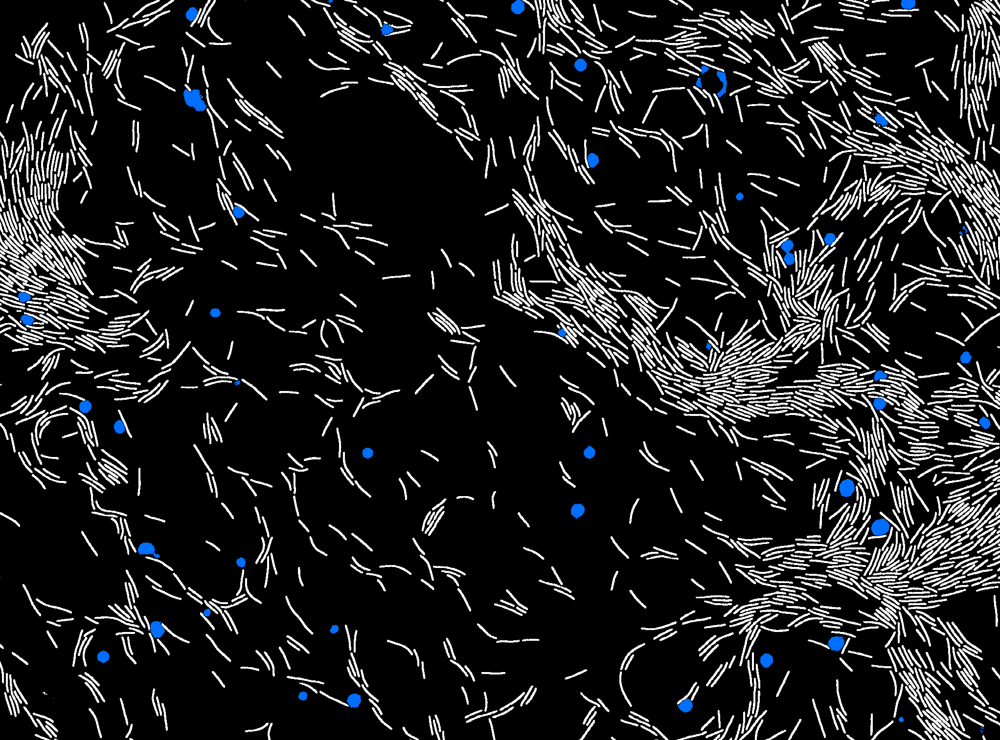

# Workshop:   Bioimage analysis applications based on Deep Learning 

## Part 1 : Fundamentals

* [DL Ex1_Clusterization_linearly_separated](https://colab.research.google.com/github/jbfiche/Deep-Learning-formation/blob/master/2022/Deep_learning_part_1/Ex1_Clusterization_linearly_separated.ipynb)
* [DL Ex2_Clusterization_not_linearly_separated_parabola](https://colab.research.google.com/github/jbfiche/Deep-Learning-formation/blob/master/2022/Deep_learning_part_1/Ex2_Clusterization_not_linearly_separated_parabola.ipynb)
* [DL Ex3_Clusterization_not_linearly_separated_spiral](https://colab.research.google.com/github/jbfiche/Deep-Learning-formation/blob/master/2022/Deep_learning_part_1/Ex3_Clusterization_not_linearly_separated_spiral.ipynb)
* Materials
  * [Introduction_deep_learning_part1_2022.pdf](https://colab.research.google.com/github/jbfiche/Deep-Learning-formation/blob/master/2022/Deep_learning_part_1/Introduction_deep_learning_part1_2022.pdf)

## Part 2 : Introduction of convolutional network and applications

* [DL Ex4_MNIST_dense_vs_convolutional_nn](https://colab.research.google.com/github/jbfiche/Deep-Learning-formation/blob/master/2022/Deep_learning_part_2/Ex4_MNIST_dense_vs_convolutional_nn.ipynb)
* [DL Ex5_RBC_image_classification](https://colab.research.google.com/github/jbfiche/Deep-Learning-formation/blob/master/2022/Deep_learning_part_2/Ex5_RBC_image_classification.ipynb)
* [DL Ex6_bacteria_segmentation_with_Unet](https://colab.research.google.com/github/jbfiche/Deep-Learning-formation/blob/master/2022/Deep_learning_part_2/Ex6_bacteria_segmentation_unet.ipynb)
* [DL_Ex7_nuclei_segmentation_with_StarDist](https://colab.research.google.com/github/jbfiche/Deep-Learning-formation/blob/master/2022/Deep_learning_part_2/Ex7_nuclei_segmentation_stardist.ipynb)
* Materials
  * [Introduction_deep_learning_part2_2022.pdf](https://colab.research.google.com/github/jbfiche/Deep-Learning-formation/blob/master/2022/Deep_learning_part_2/Introduction_deep_learning_part2_2022.pdf)
